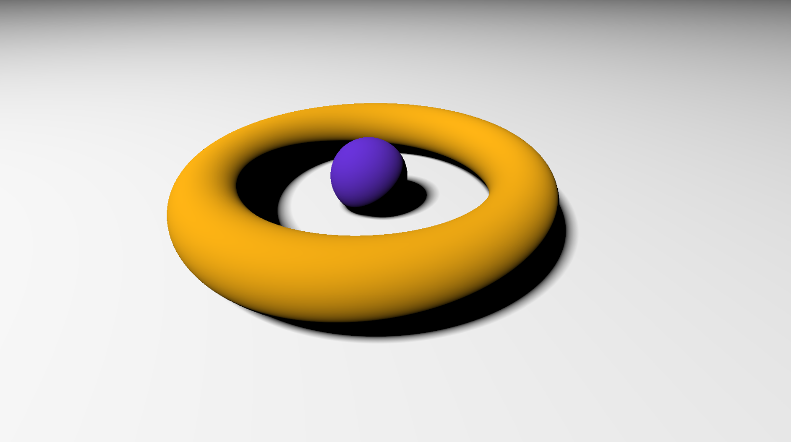

# Raymarching-Sandbox

Implementation of raymarching techniques, namely soft shadows, ndotl lighting and color correction. If you can call that a "technique". 
Most stuff was taken from shadertoy and IQ's blog because my math PhD hasn't arrived yet.

Ref: http://iquilezles.org/www/index.htm

## Features

	Soft/Hard shadows
	Ambient Occlusion
	NdotL lighting
	Sphere/Torus SDF

## How it works

To render the final composite, I use a struct that acts as a sort of GBuffer, holding a bunch of information about the fragment.

	struct RenderInfo
	{
		float3 worldPos;
		float3 normal;
		float shadow;
		float light;
		float ao;
	};

These are obtain from a bunch of functions, but the calls to those are wrapped within a single render() call. That function only needs worldPos and direction as an input, so it's pretty straight forward to plug into the raymarcher.

After all the channels are obtained, they're multiplied and the final result is adjusted for the correct colorspace.

	    return pow(light * shadow * ao * pow(color, 2.2), 1.0/2.2);

I had reflections working, but with a lack of ambient GI it didn't look good.

# Sample

# Consider buying me a coffee if you like my work (click the image)

